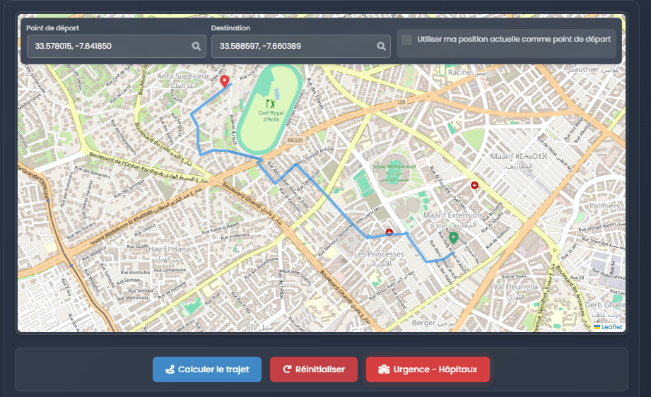
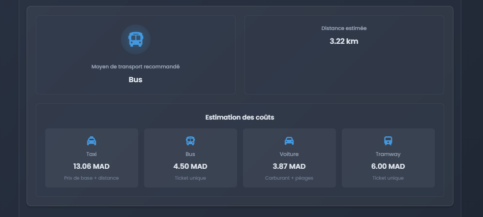
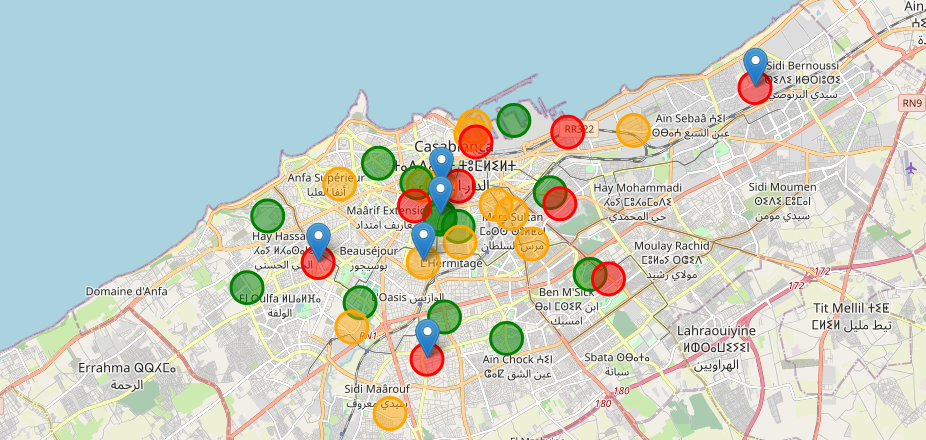

# 🚗 Transport Recommendation System

A sophisticated web application that provides intelligent transport recommendations and cost estimations for routes in Morocco, specifically optimized for Casablanca. Built with microservices architecture using gRPC and Flask, this system helps users find the most efficient transportation mode for their journey.

## ✨ Features

### 🗺️ Interactive Route Planning
- **Dynamic Map Interface**: Powered by Leaflet.js and OpenStreetMap for smooth, interactive navigation
- **Click-to-Select**: Simply click two points on the map to calculate your route
- **Real-time Route Visualization**: See your route drawn on the map with beautiful animations
- **Geolocation Support**: Use your current location as a starting point

### 🚌 Smart Transport Recommendations
The system analyzes your route and recommends the most suitable transport mode:
- **Taxi** 🚕 - For short distances (ideal for quick trips)
- **Tramway** 🚊 - For medium distances (efficient and cost-effective)
- **Bus** 🚌 - For long distances (economical for extended journeys)

### 💰 Cost Estimation
Get accurate cost estimates for different transport modes:
- **Taxi fares** with per-kilometer pricing
- **Tramway ticket** costs
- **Bus fare** estimates
- Compare costs to make informed decisions

### 🎨 Modern User Interface
- Sleek dark theme with gradient backgrounds
- Smooth animations and transitions
- Responsive design for all devices
- Font Awesome icons for visual clarity
- Loading indicators for better UX

### 📊 User Feedback System
- Star-based rating system (1-5 stars)
- Comment and review functionality
- Real-time feedback display
- Anonymous user reviews

## 📸 Screenshots

### Route Selection & Trajectory Planning

*Select start and end points on the interactive map to plan your route*

### Transport Recommendations

*Get intelligent transport mode suggestions with cost breakdowns for your journey*

### Traffic Zones & Analysis

*View traffic zones and optimize your route planning*

## 🏗️ Architecture

This application uses a microservices architecture for scalability and maintainability:

```
┌─────────────┐         ┌─────────────┐         ┌─────────────┐
│   Browser   │ ◄─────► │   Flask     │ ◄─────► │    gRPC     │
│  (Frontend) │  HTTP   │   Server    │  gRPC   │   Server    │
└─────────────┘         └─────────────┘         └─────────────┘
                              │                        │
                              ▼                        ▼
                        ┌─────────────┐         ┌─────────────┐
                        │  Templates  │         │  OSMnx +    │
                        │  & Static   │         │  NetworkX   │
                        └─────────────┘         └─────────────┘
```

### Components

- **Frontend (Flask)**: Serves the web interface and handles HTTP requests
- **gRPC Server**: Processes route calculations and transport recommendations
- **OSMnx Integration**: Uses real OpenStreetMap data for Casablanca road network
- **NetworkX**: Graph algorithms for shortest path calculations
- **Protocol Buffers**: Efficient data serialization between services

## 🚀 Setup & Installation

### Prerequisites
- Python 3.10 or higher
- pip package manager
- Internet connection (for initial map data)

### Step 1: Clone the Repository
```bash
git clone https://github.com/ELMANDOURIHAMZA/Reco_Transport.git
cd Reco_Transport
```

### Step 2: Create Virtual Environment
```bash
# Windows
python -m venv venv
venv\Scripts\activate

# Linux/Mac
python3 -m venv venv
source venv/bin/activate
```

### Step 3: Install Dependencies
```bash
pip install -r requirements.txt
```

Required packages:
- `grpcio==1.62.1` - gRPC framework
- `grpcio-tools==1.62.1` - Protocol buffer compiler
- `Flask==2.3.2` - Web framework
- `networkx==3.1` - Graph algorithms
- `osmnx==1.3.0` - OpenStreetMap integration
- `scikit-learn` - Machine learning utilities (required by osmnx)
- `protobuf==4.25.3` - Protocol buffers

### Step 4: Start the gRPC Server
```bash
cd grpc_server
python server.py
```
You should see: `Serveur gRPC en cours d'exécution sur le port 50051...`

### Step 5: Start the Frontend Server
Open a new terminal and run:
```bash
cd frontend
python app.py
```

### Step 6: Access the Application
Open your browser and navigate to: **http://localhost:5000**

## 📁 Project Structure

```
transport_recommendation/
│
├── frontend/                    # Flask web application
│   ├── app.py                  # Main Flask application
│   ├── templates/              # HTML templates
│   │   ├── index.html         # Main page with map interface
│   │   ├── faq.html           # FAQ page
│   │   ├── privacy.html       # Privacy policy
│   │   ├── support.html       # Support page
│   │   └── terms.html         # Terms of service
│   └── static/                # Static assets (CSS, JS, images)
│
├── grpc_server/                # gRPC microservice
│   ├── server.py              # gRPC server implementation
│   ├── routing.py             # Route calculation logic
│   ├── recommender.py         # Transport recommendation engine
│   ├── generate_graph.py      # OSM graph generation utility
│   ├── transport_pb2.py       # Generated Protocol Buffer code
│   └── transport_pb2_grpc.py  # Generated gRPC code
│
├── proto/                      # Protocol Buffer definitions
│   └── transport.proto        # Service and message definitions
│
├── data/                       # Application data
│   └── city_map.graphml       # Casablanca road network graph
│
├── cache/                      # Geocoding cache (JSON files)
│
├── pic/                        # Screenshots and images
│   ├── trajectoryselection.png
│   ├── recommendations.png
│   └── trafficzones.png
│
├── requirements.txt            # Python dependencies
└── README.md                  # This file
```

## 🛠️ Technologies Used

### Backend
- **Python 3.10** - Programming language
- **Flask 2.3.2** - Web framework for serving the frontend
- **gRPC 1.62.1** - High-performance RPC framework for microservices
- **Protocol Buffers** - Efficient data serialization
- **NetworkX 3.1** - Graph algorithms for route calculation
- **OSMnx 1.3.0** - OpenStreetMap network analysis
- **scikit-learn** - Scientific computing (required by osmnx)

### Frontend
- **HTML5** - Structure
- **CSS3** - Styling with modern features (Grid, Flexbox, animations)
- **JavaScript (ES6+)** - Client-side logic
- **Leaflet.js 1.9.4** - Interactive mapping library
- **OpenStreetMap** - Map tiles and geocoding
- **Font Awesome 6.0** - Icon library
- **Google Fonts (Poppins)** - Typography

## 🔧 How It Works

1. **User Interaction**: User clicks two points on the map (start and destination)
2. **Frontend Request**: JavaScript sends coordinates to Flask server via HTTP POST
3. **gRPC Communication**: Flask forwards request to gRPC server
4. **Route Calculation**: 
   - OSMnx finds nearest nodes on the road network
   - NetworkX calculates shortest path using Dijkstra's algorithm
   - Distance is computed from edge weights
5. **Transport Recommendation**: Algorithm analyzes route length and recommends optimal transport mode
6. **Response**: Route coordinates, distance, and recommendation sent back to frontend
7. **Visualization**: Route drawn on map with cost breakdown displayed

## 🎯 Use Cases

- **Daily Commuters**: Find the most cost-effective way to get to work
- **Tourists**: Navigate Casablanca efficiently with local transport recommendations
- **Urban Planners**: Analyze transport patterns and costs
- **Students**: Budget-friendly route planning for educational institutions
- **Business Travelers**: Quick cost comparisons for transport options

## 🔮 Future Enhancements

- [ ] Real-time traffic data integration
- [ ] Multi-city support (Rabat, Marrakech, Tangier)
- [ ] Save favorite routes
- [ ] User authentication and profile management
- [ ] Integration with ride-sharing services APIs
- [ ] Public transport schedules
- [ ] Bike and walking route options
- [ ] Weather-based recommendations
- [ ] Mobile application (iOS/Android)
- [ ] API for third-party integrations

## 🤝 Contributing

We welcome contributions! Here's how you can help:

1. **Fork the repository**
2. **Create a feature branch**: `git checkout -b feature/AmazingFeature`
3. **Commit your changes**: `git commit -m 'Add some AmazingFeature'`
4. **Push to the branch**: `git push origin feature/AmazingFeature`
5. **Open a Pull Request**

### Development Guidelines
- Follow PEP 8 style guide for Python code
- Add comments for complex logic
- Update documentation for new features
- Test thoroughly before submitting PR

## 📝 License

This project is licensed under the MIT License - see the LICENSE file for details.

## 👥 Authors

Built with ❤️ for the Moroccan transport community

## 🙏 Acknowledgments

- **OpenStreetMap** contributors for map data
- **OSMnx** project for excellent graph analysis tools
- **Leaflet.js** for interactive mapping capabilities
- **gRPC** team for robust RPC framework
- **Flask** community for comprehensive documentation

---

**Note**: This application uses real OpenStreetMap data for Casablanca. The road network graph is pre-generated and stored in `data/city_map.graphml`. To regenerate the graph or extend to other cities, use `grpc_server/generate_graph.py`. 